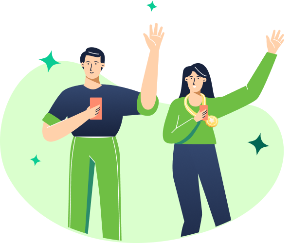

# 🚀 Wide Coverage Landing Page

Projeto de uma landing page moderna e responsiva desenvolvida com **HTML5 e CSS3**, com foco em prática de layout, responsividade e boas práticas de front-end.

---

## 📸 Preview



---

## 🛠️ Tecnologias utilizadas

* HTML5
* CSS3
* Google Fonts (Poppins)

---

## 💻 Sobre o projeto

Este projeto simula uma página inicial de um serviço de mobilidade, com foco em:

* Estruturação semântica com HTML
* Estilização moderna com CSS
* Layout responsivo com **Flexbox**
* Adaptação para dispositivos móveis com **@media queries**

---

## 📱 Responsividade

O projeto foi desenvolvido para funcionar bem em diferentes tamanhos de tela:

* 💻 Desktop
* 📱 Tablet
* 📲 Mobile

---

## 🎯 Aprendizados

Durante o desenvolvimento, foram praticados conceitos importantes como:

* Uso de `flexbox` para layout
* Criação de interfaces responsivas
* Organização de código CSS
* Ajustes de design para diferentes dispositivos

---

## 📂 Estrutura do projeto

```
📁 projeto
 ┣ 📁 assets
 ┃ ┗ imagem2.png
 ┣ 📄 index.html
 ┗ 📄 styles.css
```

## ✨ Melhorias futuras

* Menu responsivo (hambúrguer)
* Animações com CSS
* Versão dark mode 🌙
* Integração com JavaScript

---

## 👩‍💻 Autora

Feito com dedicação por **Tamires Marinho Rodrigues** 💜

---

## 📌 Status do projeto

🚧 Em desenvolvimento

---
